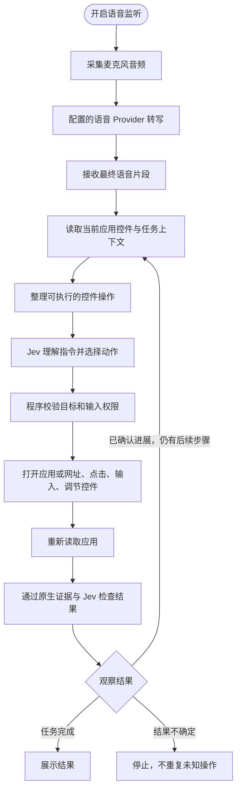

<p align="center"></p>

# Computah

<p align="center">
  <a href="README.md">English</a> · <strong>简体中文</strong>
</p>

这是 [musubipapi/computah](https://github.com/musubipapi/computah) 的中文本土化分支。
Computah 是一个基于 TypeSafe Jev 的实验性原生 macOS 语音 Agent，可以通过语音控制 Mac。

Computah 使用 macOS Accessibility 读取当前应用暴露的窗口、按钮、输入框等原生控件。
语音服务负责转写，Jev 结合用户指令与当前界面选择下一步动作，程序在执行前校验目标，
执行后重新读取界面并确认结果。

**这是实验性项目。** 部分应用暴露的辅助功能信息不完整，模型也可能选择错误操作。
请勿在未检查结果的情况下，将它用于重要或不可逆操作。

## 此分支的改动

此分支由 Nathan Qian 维护，重点面向中文语音和中国用户常见的办公场景。

- 接入火山引擎豆包流式语音识别模型 2.0，使用二遍识别的确定结果提交命令。
- 保留 Deepgram，可通过配置切换语音 Provider。
- 接入 OpenRouter，同时保留 TypeSafe 官方 Jev API。
- 记录 Jev 的实际或估算费用，以及火山语音时长和估算费用。
- Live 诊断最多允许 3 次 Jev 请求，避免异常重试造成额外费用。
- 优化中文文本输入目标选择，不依赖应用名称、命令关键词或正则路由。
- 在刘海区域展示执行中、完成、停止和需要补充信息等反馈。
- 增加 Provider 配置、火山二进制协议、转写结果、费用与请求预算的离线检查。

中文办公软件适配仍在持续推进，当前能力不代表对所有应用和流程都能稳定执行。

## 工作原理



### 1. 语音输入

监听开启后，Computah 将麦克风音频转换为 16 kHz、单声道 PCM16，
并通过 WebSocket 发送到配置的语音 Provider。

- `volcengine`：豆包流式语音识别模型 2.0，默认开启二遍识别。
- `deepgram`：使用 Deepgram Flux，保留其提前准备能力。

火山模式只将 `definite=true` 的确定结果提交给 Jev，实时中间结果仅用于界面展示。

### 2. 理解命令

Computah 读取前台应用的 Accessibility 控件，并把经过整理的候选动作交给 Jev。
Jev 负责理解自然语言、选择目标和判断请求之间的关系。

代码负责校验：

- 原始文本范围和输入值；
- 前台应用、窗口与原生控件身份；
- 操作权限、次数与时间限制；
- 输入后观察到的真实结果。

生产逻辑不会通过应用名称、固定动词列表或正则表达式决定用户意图。

### 3. 执行与确认

发送点击或键盘输入不代表任务已经成功。
Computah 会重新读取应用，并根据目标控件、文档身份和状态变化确认结果。

如果上一次输入的结果无法确认，程序会停止，不会为了“试试看”而重复点击或输入。
当命令缺少必要信息或无法继续时，刘海区域会显示反馈。

## 环境要求

- macOS 14 或更高版本；
- Xcode 或带 Swift 6 的 Command Line Tools；
- Python 3；
- TypeSafe API Key 或 OpenRouter API Key；
- 火山引擎豆包语音 API Key 或 Deepgram API Key。

Provider 调用可能产生费用，请查看对应平台的最新价格和账户额度。

## 配置

在项目目录创建本地配置：

```sh
cp .env.example .env
chmod 600 .env
```

推荐的中文配置：

```dotenv
JEV_PROVIDER=openrouter
TYPESAFE_API_KEY=
OPENROUTER_API_KEY=

SPEECH_PROVIDER=volcengine
DEEPGRAM_API_KEY=
VOLCENGINE_SPEECH_API_KEY=
VOLCENGINE_SPEECH_RESOURCE_ID=volc.seedasr.sauc.duration
```

也可以使用以下组合：

| 能力 | 配置值 | 凭证 |
| --- | --- | --- |
| Jev 直连 | `JEV_PROVIDER=typesafe` | `TYPESAFE_API_KEY` |
| Jev 经 OpenRouter | `JEV_PROVIDER=openrouter` | `OPENROUTER_API_KEY` |
| 火山语音 | `SPEECH_PROVIDER=volcengine` | `VOLCENGINE_SPEECH_API_KEY` |
| Deepgram | `SPEECH_PROVIDER=deepgram` | `DEEPGRAM_API_KEY` |

`.env` 已被 Git 忽略。不要提交、截图或分享真实 API Key。

## 构建与启动

```sh
zsh scripts/run.sh
```

构建产物位于 `outputs/Computah.app`。

首次使用需要在：

**系统设置 → 隐私与安全性 → 辅助功能**

中添加并启用 `outputs/Computah.app`。首次开启语音监听时还需要允许麦克风权限。

## 使用

- 同时按下 **Control + Option** 开启或停止监听。
- 将鼠标移到刘海区域可查看转写、状态和控制按钮。
- 打开 **…** 菜单并选择 **Open Debug Mode…**，可输入文字命令或检查运行详情。
- Debug Mode 展示执行步骤、观察结果、Jev 请求次数、Token 与费用。
- 选择 **Quit Computah** 退出。

## 成本控制

### Jev

- 在 HTTP 请求边界记录每次调用；
- 优先显示 Provider 返回的实际费用；
- 缺少实际费用时使用已知价格估算；
- Live 诊断最多执行 3 次 Jev HTTP 请求。

### 火山语音

- 记录聚合语音时长，不保存音频或转写文本；
- 优先使用 Provider 返回的音频时长；
- 缺少时长时按已发送的 PCM 字节数估算；
- 当前估算价格为 1 元/小时，实际费用以火山引擎账单为准。

聚合费用文件保存在 `outputs/computah/`，该目录不会被 Git 提交。

## 隐私

监听开启时，麦克风音频会发送到配置的语音 Provider。
命令和部分应用内容会发送到配置的 Jev Provider，用于选择动作和检查结果。
这些内容可能包含文档文字、姓名、地址等私人信息。

默认情况下，应用只在内存中保留最近 30 条结果，不保存日常命令历史。
详细说明见 [隐私与调试数据](docs/PRIVACY.md)。

## 开发与检查

```sh
zsh scripts/build.sh
swift run ComputahCoreChecks
python3 scripts/check-public-tree.py
```

项目包含三个生产 Target：

| 目录 | 职责 |
| --- | --- |
| `Sources/Computah` | 刘海界面、Debug 面板、麦克风、应用启动与 Provider 会话 |
| `Sources/ComputahSpeech` | 语音 Provider 配置、火山协议编解码与转写解析 |
| `Sources/ComputahCore/Accessibility` | 读取和组织控件，发送经过校验的原生输入 |
| `Sources/ComputahCore/Commands` | 管理任务、处理中断、执行并检查结果 |
| `Sources/ComputahCore/Language` | 构造 Jev 问题并校验响应 |
| `Sources/ComputahCore/Prompts` | 保存 Jev 问题语义 |
| `Tests` | 离线检查和显式授权的真实端到端测试 |

更多资料：

- [架构](docs/ARCHITECTURE.md)
- [测试](docs/TESTING.md)
- [Jev 请求格式](docs/JEV_REQUESTS.md)
- [安装问题](docs/SETUP.md)

## 上游与许可

原项目：[musubipapi/computah](https://github.com/musubipapi/computah)

本分支遵循 [MIT License](LICENSE)，并保留原项目及贡献者署名。
内置提示音另遵循
[Cuelume License](Sources/Computah/Resources/Sounds/Cuelume-LICENSE.txt)。
